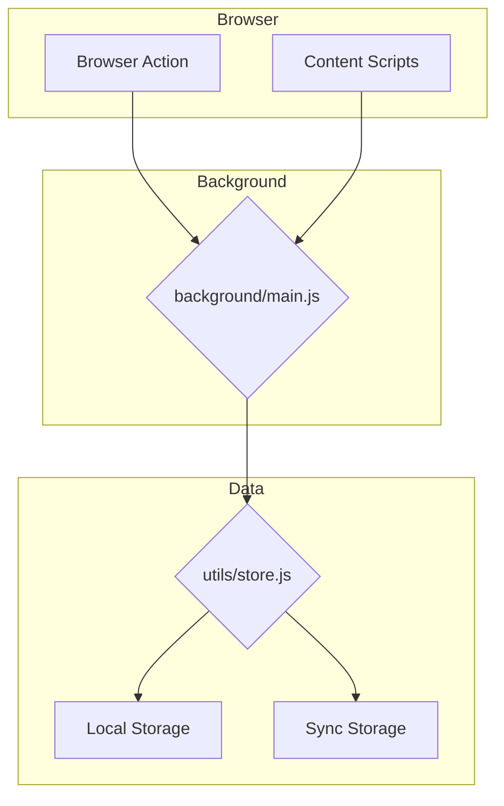
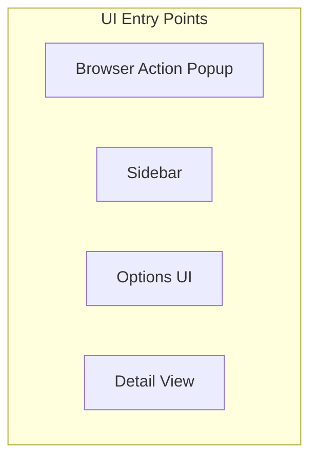

# Application Architecture

This document provides a high-level overview of the application's architecture, including the data flow and UI component hierarchy.

## Data Flow

The following diagram illustrates how data flows through the application:

## UI Component Hierarchy

The following diagram illustrates the UI component hierarchy:

